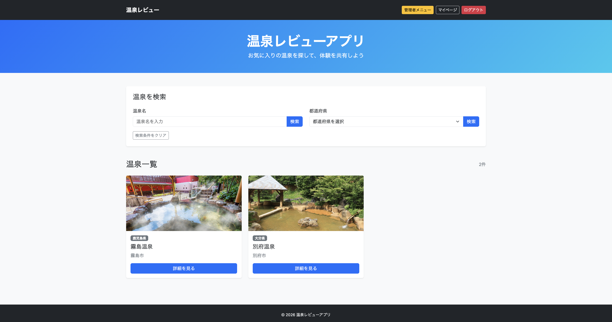
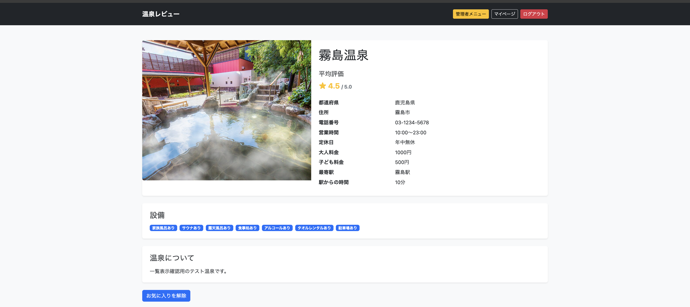
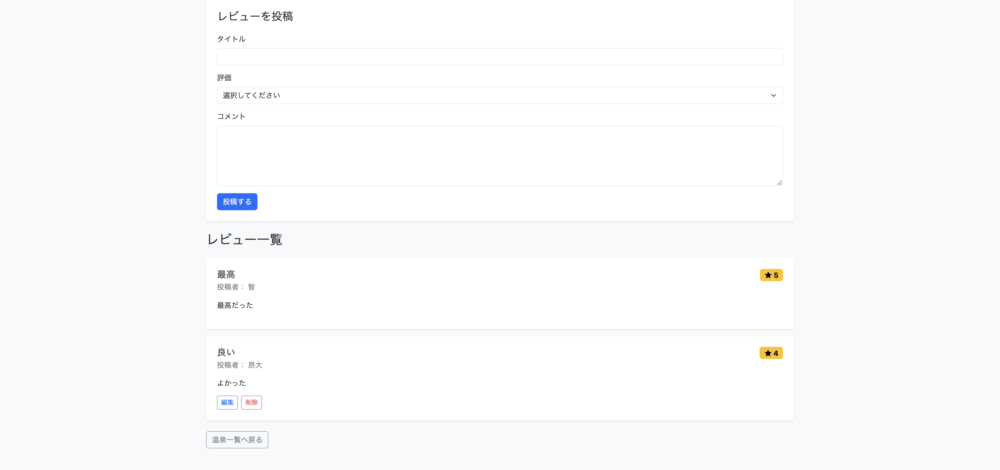
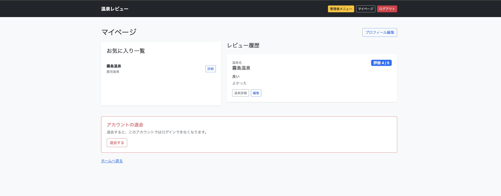
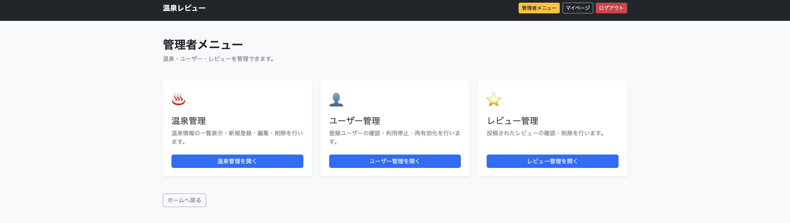
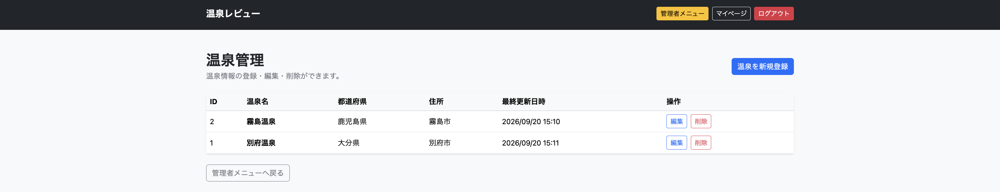

# 温泉レビューアプリ

## 概要

温泉施設の検索、レビュー投稿、お気に入り登録ができるWebアプリです。

## 画面イメージ

| 温泉一覧・検索 | 温泉詳細 |
| --- | --- |
|  |  |

| レビュー投稿・一覧 | マイページ |
| --- | --- |
|  |  |

| 管理者メニュー | 温泉管理 |
| --- | --- |
|  |  |


## 使用技術

* Java 17
* Spring Boot
* Spring Data JPA
* Spring Security
* Thymeleaf
* PostgreSQL
* Bootstrap
* JUnit
* Mockito

## 主な機能

### 未ログインユーザー

* 新規会員登録
  * 入力内容のバリデーション
  * メールアドレスの重複チェック
  * BCryptによるパスワードのハッシュ化
* メールアドレスとパスワードによるログイン
* 温泉情報の一覧表示
* 温泉名による部分一致検索
* 都道府県による検索
* 温泉の詳細情報、平均評価、レビュー一覧の表示

### 一般ユーザー

* ログアウト
* レビューの投稿
* 自分が投稿したレビューの編集・削除
* 同じ温泉への重複投稿防止
* お気に入りの登録・解除
* マイページでのお気に入り一覧表示
* マイページでのレビュー履歴表示
* ユーザー名の変更
* アカウントの退会（論理削除）

### 管理者

* 管理者専用画面へのアクセス制御
* 温泉情報の一覧表示・新規登録・編集・削除
* ユーザー情報の一覧表示
* 一般ユーザーの利用停止・再有効化
* レビューの一覧表示・削除
* レビューまたはお気に入りが登録されている温泉の削除防止

## 設計資料

要件定義、画面設計、画面遷移図、ER図、テーブル定義などをNotionにまとめています。

[温泉レビューアプリの設計資料を確認する](https://bolder-pigeon-9a9.notion.site/394fcab5830880e39e42c67b84a1ebf7)

## 自動テスト

JUnitとMockitoを使用し、Service層の単体テストを実装しています。

主に以下の処理を検証しています。

* 複数レビューからの平均評価計算
* レビューが0件の場合の平均評価
* 一般ユーザーの利用停止・再有効化
* 管理者および存在しないユーザーの利用停止防止
* 関連するレビューやお気に入りが存在する温泉の削除防止
* 関連データが存在しない温泉の削除

テストは次のコマンドで実行できます。

```bash
./mvnw test
```

## 環境構築・起動方法

### 前提環境

* Java 17
* PostgreSQL
* Git

Maven Wrapperを使用するため、Mavenを別途インストールする必要はありません。

### 1. リポジトリを取得

```bash
git clone https://github.com/shirakou/onsen-review-app.git
cd onsen-review-app
```

### 2. データベースを作成

PostgreSQLで次のデータベースを作成します。

```sql
CREATE DATABASE onsen_review_app;
```

### 3. ローカル設定ファイルを作成

`src/main/resources/application-local.properties`を作成し、使用するPostgreSQLの接続情報を設定します。

```properties
spring.datasource.url=jdbc:postgresql://localhost:5432/onsen_review_app
spring.datasource.username=使用するユーザー名
spring.datasource.password=使用するパスワード

server.servlet.session.timeout=30m
```

`application-local.properties`は`.gitignore`の対象としており、認証情報はリポジトリに含まれません。

### 4. アプリケーションを起動

```bash
./mvnw spring-boot:run
```

起動後、ブラウザで以下へアクセスします。

```text
http://localhost:8080
```

## 学習・実装で苦戦した点

### Spring Securityによる認証処理

これまで実装してきた機能では、「ユーザーがURLにアクセス → Controllerがリクエストを受け取る → HTMLを表示 → フォームの入力内容をPOSTで送信 → ControllerのPOST処理で受け取る」という流れが基本だった。

しかし、今回のログイン機能では、POSTされたログイン情報をControllerではなくSpring Securityが受け取り、認証処理を行う。そのため、これまでとは異なる処理の流れを理解することに苦戦した。

`SecurityFilterChain`については、「どのURLへのアクセスを許可するか」「ログイン成功後やログアウト後にどこへ遷移するか」といった設定が中心だったため、比較的スムーズに理解できた。

特に苦戦したのは`DaoAuthenticationProvider`の役割だった。当初は、`provider`変数に取得したUserの情報やパスワードそのものが格納されていると考えていた。

実際には、`DaoAuthenticationProvider`に対して、`CustomUserDetailsService`を使った「ユーザー情報の取得方法」と、`PasswordEncoder`を使った「パスワードの照合方法」を設定している。

この違いを理解することで、Spring Securityでは認証に必要なデータを事前に`provider`へ格納するのではなく、認証時に必要な処理を行うための設定を組み立てている、というイメージを持てるようになった。

### 温泉詳細表示

検索結果に表示された「詳細」リンクを押すことで、選択した温泉のIDを含む`/onsens/{onsenId}`へアクセスする。

Controllerでは`@PathVariable`を使用してURLから`onsenId`を受け取り、Serviceの`getOnsenById()`を呼び出す。

ServiceではRepositoryの`findById()`を使用し、指定されたIDに対応する温泉情報をDBから取得する。

`findById()`の戻り値には`Optional<Onsen>`を使用している。温泉IDは主キーであるため検索結果は最大1件となり、「温泉が存在する状態」と「存在しない状態」の両方を表現できるためである。

Controllerで取得結果を確認し、温泉が存在しない場合はホーム画面へリダイレクトする。

温泉が存在する場合は、`Optional`の`get()`を使用して中に格納されている`Onsen`オブジェクトを取り出し、Modelに格納する。

最後に`onsen/detail.html`へModelを渡し、取得した温泉の詳細情報を画面に表示する。

### レビュー編集・削除時の本人確認

レビューの編集・削除機能では、ログインユーザーがレビューの投稿者本人であるかを確認する処理を実装した。

Controllerの引数で`Authentication`を受け取り、`getName()`を使用してログイン時のメールアドレスを取得する。取得したメールアドレスと、レビューに紐づくユーザーのメールアドレスを比較し、一致しない場合は温泉詳細画面へリダイレクトする。

本人確認は、編集画面を表示するGET処理だけでなく、更新と削除を実行するPOST処理でも行っている。これにより、画面上のボタンを経由せずURLへ直接リクエストされた場合でも、他人のレビューが更新・削除されることを防いでいる。

画面側では、Thymeleafの`th:if`を使用して、ログインユーザーとレビュー投稿者が一致する場合にだけ編集・削除ボタンを表示する。

`#authentication.name`にはログイン認証に使用しているメールアドレスが格納されているため、画面表示用の`username`ではなく、`review.user.email`と比較する必要があった。

また、`${...}`の中でJavaコードを直接実行しているのではなく、Controllerから渡されたJavaオブジェクトやSpring Securityの認証情報を、Thymeleafがサーバー側で処理してHTMLを生成していることを理解した。

### 退会処理とログインセッションの終了

退会機能では、ログインユーザーの情報をDBから物理的に削除するのではなく、`User`エンティティの`isActive`を`false`へ変更する論理削除を採用した。これにより、ユーザーに紐づくデータを残したまま、アカウントの利用可否を切り替えられるようにした。

Controllerでは`Authentication`からログインユーザーのメールアドレスを取得し、Serviceの退会処理へ渡す。Serviceではメールアドレスに対応するユーザーを検索し、存在する場合は`isActive`を`false`へ変更してRepositoryの`save()`で保存する。

ただし、DB上の`isActive`を変更しただけでは、ブラウザが保持している現在のログインセッションは直ちに終了しない。そのため、退会処理に成功した場合は`SecurityContextLogoutHandler`の`logout()`へ`HttpServletRequest`、`HttpServletResponse`、`Authentication`を渡し、現在のセッションと認証情報を消去する処理を実装した。

ログアウト後は`/login?withdrawn`へリダイレクトする。ログイン画面では、Thymeleafの`th:if="${param.withdrawn}"`を使用してURLパラメータの存在を確認し、退会処理が完了したことを示すメッセージを表示している。

## 補足

本READMEの「学習・実装で苦戦した点」は、実装時に自身で理解した内容や考えたことを文章化し、生成AIを利用して誤字や表現、文章構成を整えています。

実装内容や学習内容については、自身でコードを確認・動作検証しながら記載しています。